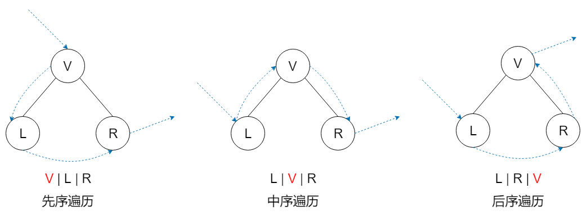

# 概述

二叉树的遍历是一个很常见的问题。二叉树的遍历方式主要有：先序遍历、中序遍历、后序遍历、层次遍历。先序、中序、后序其实指的是父节点被访问的次序。若在遍历过程中，父节点先于它的子节点被访问，就是先序遍历；父节点被访问的次序位于左右孩子节点之间，就是中序遍历；访问完左右孩子节点之后再访问父节点，就是后序遍历。不论是先序遍历、中序遍历还是后序遍历，左右孩子节点的相对访问次序是不变的，总是先访问左孩子节点，再访问右孩子节点。而层次遍历，就是按照从上到下、从左向右的顺序访问二叉树的每个节点。




在介绍遍历算法之前，先定义一个二叉树的结构体。使用的是 C++ 语言。

```cpp
//filename: BinTreeNode.h
template <typename T> struct BinTreeNode {
    T data; //数据域
    BinTreeNode * LeftChild; //左孩子节点指针
    BinTreeNode * RightChild; //右孩子节点指针
    BinTreeNode * parent; //父节点指针
};
```

# 先序遍历

## 递归

使用递归，很容易写出一个遍历算法。代码如下：

```cpp
//filename: BinTreeNode.h
template <typename T>
void travPre_R(BinTreeNode<T> * root) {//二叉树先序遍历算法（递归版）
	if (!root) return;
	cout << root->data;
	travPre_R(root->LeftChild);
	travPre_R(root->RightChild);
}
```

## 迭代

在之前的文章中，我不止一次地说过，递归是很耗费计算机资源的，所以我们在写程序的时候要尽量避免使用递归。幸运的是，绝大部分递归的代码都有相应的迭代版本。那么我们就试着将上述递归代码改写成迭代的版本。改写之后，代码如下：

```cpp
//filename: BinTreeNode.h
template <typename T>
void travPre_I1(BinTreeNode<T> * root) {//二叉树先序遍历算法（迭代版#1）
	Stack<BinTreeNode<T>*> s; //辅助栈
	if (root) //如果根节点不为空
		s.push(root); //则令根节点入栈
	while (!s.empty()) { //在栈变空之前反复循环
		root = s.pop(); cout << root->data; //弹出并访问当前节点
        
        //下面左右孩子的顺序不能颠倒，必须先让右孩子先入栈，再让左孩子入栈。
		if (root->RightChild)
			s.push(root->RightChild); //右孩子先入后出
		if (root->LeftChild)
			s.push(root->LeftChild); //左孩子后入先出
	}
}
```

下面我们通过一个实例来了解一下该迭代版本是如何工作的。


PS：黑色的元素表示已经被弹出并访问过。

结合代码，该二叉树的先序遍历过程如下：

1. 初始化一个空栈。
2. 根节点入栈，此时将 a 入栈。
3. 循环开始，弹出并访问栈顶元素，此时栈顶元素是 a。
4. 如果 a 有右孩子，则将其右孩子节点入栈；如果 a 有左孩子，则将其左孩子节点入栈。此时栈中有 b、c 两个元素。
5. 这时进入下一轮循环。弹出并访问栈顶元素，此时栈顶元素是 b。经检查，b 没有右孩子，也没有左孩子，进入下一轮循环。
6. 弹出并访问栈顶元素，此时栈顶元素是 c。c 的右孩子是 f，左孩子是 d，故分别将 d、f 入栈。进入下一轮循环。
7. 此时栈中的元素是 d、f。
8. 弹出并访问栈顶元素，此时栈顶元素是 d。d 的右孩子是 e，d 没有左孩子，故将 e 入栈。进入下一轮循环。
9. 此时栈中的元素是 e、f。
10. 弹出并访问栈顶元素，此时栈顶元素是 e。e 没有左右孩子，进入下一轮循环。
11. 弹出并访问栈顶元素，此时栈顶元素是 f。f 没有左右孩子，进入下一轮循环。
12. 此时栈为空，退出循环。遍历结束。

这个迭代的遍历算法非常简明，但是很遗憾，这种算法并不容易推广到我们接下来要研究的中序遍历和后序遍历。因此我问需要寻找另一种策略。

## 第 2 种迭代方式

我们来看一个规模更大、更具一般性的二叉树：

 (1)-Page-4(1).png)

这个二叉树的先序遍历序列是：idcabhfeglkjnmpo，也就是遵循了下图所示的顺序：

 (1)-Page-4(2).png)

再进一步，我们把二叉树抽象成下面这个样子，

 (1)-Page-5.png)

$L_0$ ~ $L_d$ 是二叉树的左侧链上的节点，$R_0$ ~ $R_d$ 分别是 $L_0 $ ~ $L_d$ 的右孩子，$T_0$ ~ $T_d$ 分别是 $L_0 $ ~ $L_d$ 的右子树。不难发现，二叉树的先序遍历就是先自上而下访问左侧链上的节点,再自下而上访问左侧链上的节点的右子树。而我们的遍历算法，就是根据这样一个思路来进行设计。

首先需要实现一个子方法，就是访问二叉树左侧链上的节点：

```cpp
//从当前节点出发，沿左分支不断深入，直至没有左分支的节点；沿途节点遇到后立即访问
template <typename T> //元素类型、操作器
static void visitAlongLeftBranch ( BinTreeNode<T>* x, Stack<BinTreeNode<T>*>& S ) {
   while ( x ) {
      cout << x->data; //访问当前节点
      if( x->RightChild )
      	 S.push ( x->RightChild ); //右孩子入栈暂存（可优化：通过判断，避免空的右孩子入栈）
      x = x->LeftChild;  //沿左分支深入一层
   }
}
```

然后是主方法，在主方法中，通过迭代，不断地调用上面这个子方法，从而实现完整的二叉树先序遍历。

```cpp
template <typename T> //元素类型、操作器
void travPre_I2 ( BinTreeNode<T>* root) { //二叉树先序遍历算法（迭代版#2）
   Stack<BinTreeNode<T>*> S; //辅助栈
   while ( true ) {
      visitAlongLeftBranch ( root, S ); //从当前节点出发，逐批访问
      if ( S.empty() ) break; //直到栈空
      root = S.pop(); //弹出下一批的起点
   }
}
```

# 中序遍历

## 递归

与先序遍历类似，递归版的中序遍历算法很容易实现，代码如下：

```cpp
template <typename T>
void travIn_R(BinTreeNode<T> * root) {//二叉树先序遍历算法（递归版）
    if (!root)
        return;
    travPre_R(root->LeftChild);
    cout << root->data;
    travPre_R(root->RightChild);
}
```

递归代码不仅容易实现，也很好理解，这里不再做过多解释。

## 迭代

参照迭代式先序遍历版本 2 的思路，在宏观上，我们可以将中序遍历的顺序抽象为，先访问二叉树的左侧链上的最底部的节点，然后访问该节点的右子树（如果有的话），然后访问该节点的父节点，然后访问该节点的父节点的右子树（如果有的话）……直至全部节点被访问完毕。如下图所示：

 (1)-Page-6.png)

按照以上思路，可以实现迭代版中序遍历算法如下：

```cpp
template <typename T> //从当前节点出发，沿左分支不断深入，直至没有左分支的节点
static void goAlongLeftBranch ( BinTreeNode<T> * x, Stack<BinTreeNode<T> * >& S ) {
	while (x) { S.push(x); x = x->LeftChild; } //当前节点入栈后随即向左侧分支深入，迭代直到无左孩子
}

template <typename T> //元素类型、操作器
void travIn_I(BinTreeNode<T> * root) {//二叉树先序遍历算法（迭代版）
   Stack<BinTreeNode<T> *> S; //辅助栈
   while ( true ) {
      goAlongLeftBranch ( root, S ); //从当前节点出发，逐批入栈
      if ( S.empty() ) break; //直至所有节点处理完毕
      root = S.pop(); 
	  cout << root->data; //弹出栈顶节点并访问之
      root = root->RightChild; //转向右子树
   }
}
```

也可以对代码稍加改进，将这两个方法写成一个方法：

```cpp
template <typename T> //元素类型
void travIn_I2 ( BinTreeNode<T>* root ) { //二叉树中序遍历算法（迭代版#2）
   Stack<BinTreeNode<T>*> S; //辅助栈
   while ( true )
      if ( root ) {
         S.push ( root ); //根节点进栈
         root = root->LeftChild; //深入遍历左子树
      } else if ( !S.empty() ) {
         root = S.pop(); //尚未访问的最低祖先节点退栈
         cout << root->data; //访问该祖先节点
         root = root->RightChild; //遍历祖先的右子树
      } else
         break; //遍历完成
}
```

# 后序遍历

## 递归

与前两个一样，二叉树的后序遍历算法可以很容易地用递归的方式实现。

```cpp
template <typename T>
void travPost_R(BinTreeNode<T> * root) {//二叉树先序遍历算法（递归版）
	if (!root)
		return;
	travPost_R(root->LeftChild);
	travPost_R(root->RightChild);
	cout << root->data;
}
```

## 迭代

但是要想用迭代的方式实现后序遍历算法，则有一定的难度，因为左、右子树的递归遍历均严格地不属于尾递归。不过，仍可继续套用此前的思路和技巧，考虑一下，后序遍历中，首先访问的是哪个节点？答案就是二叉树的最高最左侧的叶子节点。

 (1)-Page-7.png)

由于最高最左侧的叶子节点 V 可能是左孩子节点，也可能是右孩子节点，所以 V 与其父节点之间的联接用竖直的线表示。考查联接于 V 与树根之间的唯一通路（以粗线示意）。与先序与中序遍历类似地，自底而上地沿着该通路，整个后序遍历序列也可以分解为若干个片段。每一片段，分别起始于通路上的一个节点，并包括三步：访问当前节点，遍历以其右兄弟（若存在）为根的子树，以及向上回溯至其父亲节点（若存在）并转入下一片段。

基于以上理解，即可写出迭代式后序遍历算法。

```cpp
template <typename T> //在以S栈顶节点为根的子树中，找到最高左侧叶节点
static void gotoHLVFL ( Stack<BinTreeNode<T>*>& S ) { //沿途所遇节点依次入栈
   while ( BinTreeNode<T>* x = S.top() ) //自顶而下，反复检查当前节点（即栈顶）
      if ( x->LeftChild ) { //尽可能向左
         if ( x->RightChild ) S.push ( x->RightChild ); //若有右孩子，优先入栈
         S.push ( x->LeftChild ); //然后才转至左孩子
      } else //实不得已
         S.push ( x->RightChild ); //才向右
   S.pop(); //返回之前，弹出栈顶的空节点
}

template <typename T>
void travPost_I ( BinTreeNode<T>* root ) { //二叉树的后序遍历（迭代版）
   Stack<BinTreeNode<T>*> S; //辅助栈
   if ( root ) S.push ( root ); //根节点入栈
   while ( !S.empty() ) {
      if ( S.top() != root->parent ) //若栈顶非当前节点之父（则必为其右兄），此时需
         gotoHLVFL ( S ); //在以其右兄为根之子树中，找到HLVFL（相当于递归深入其中）
      root = S.pop(); cout << root->data; //弹出栈顶（即前一节点之后继），并访问之
   }
}
```

# 层次遍历

在文章开头我们已经对层次遍历做了介绍，层次遍历严格按照自上而下、自左向右的顺序访问树的节点。所以我们需要用队列作为辅助，具体代码如下：

```cpp
template <typename T> //元素类型
void travLevel ( BinTreeNode<T>* root ) { //二叉树层次遍历算法
   Queue<BinTreeNode<T>*> Q; //辅助队列
   Q.enqueue ( root ); //根节点入队
   while ( !Q.empty() ) { //在队列再次变空之前，反复迭代
      BinTreeNode<T>* x = Q.dequeue(); cout << x->data; //取出队首节点并访问之
      if ( x->LeftChild ) Q.enqueue ( x->LeftChild ); //左孩子入队
      if ( x->RightChild ) Q.enqueue ( x->RightChild ); //右孩子入队
   }
}
```

好了，以上就是二叉树的几种常见的遍历方式，各位小伙伴看完如果有什么疑问或建议欢迎与我交流。

最后，欢迎大家关注我的微信公众号：AProgrammer

